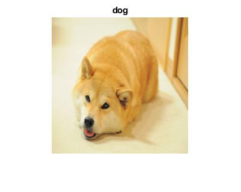
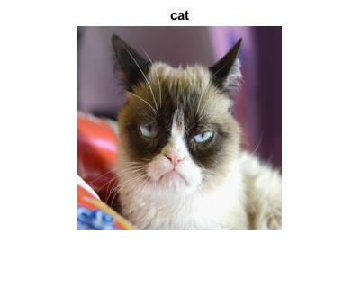
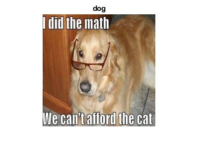
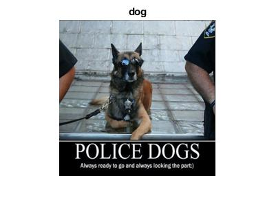
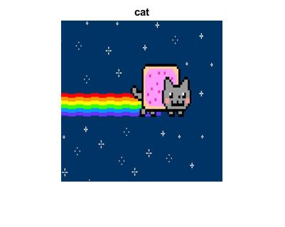
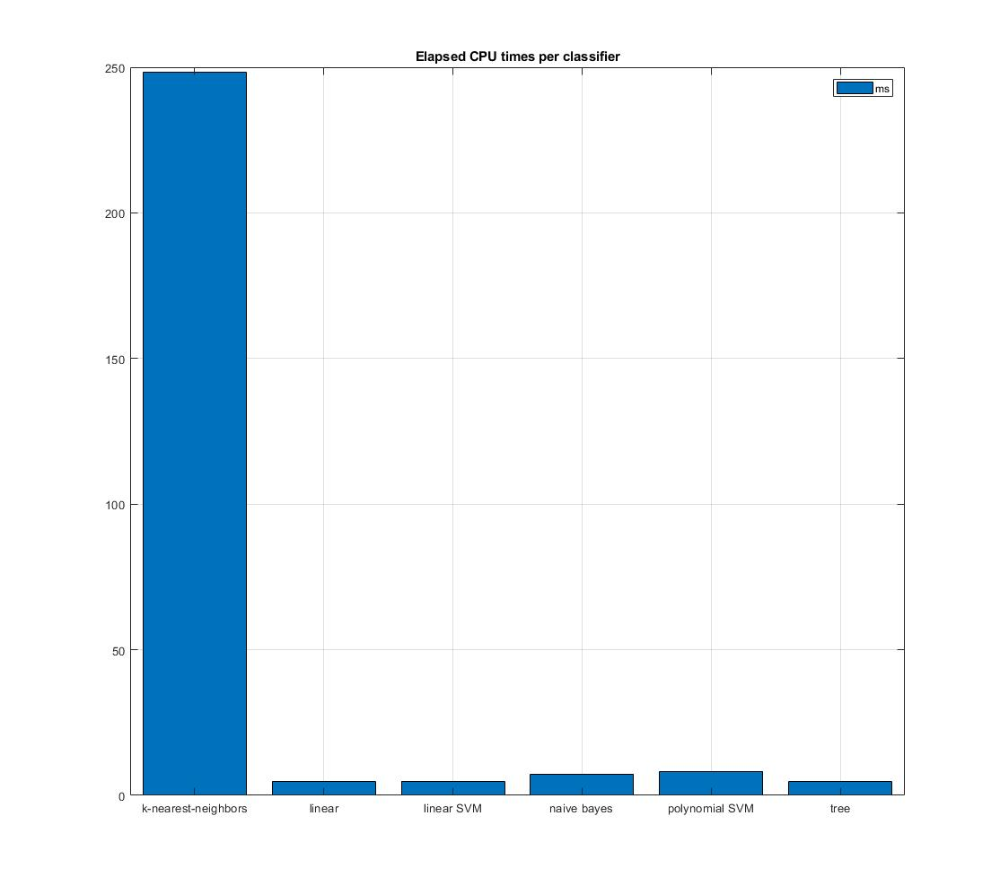
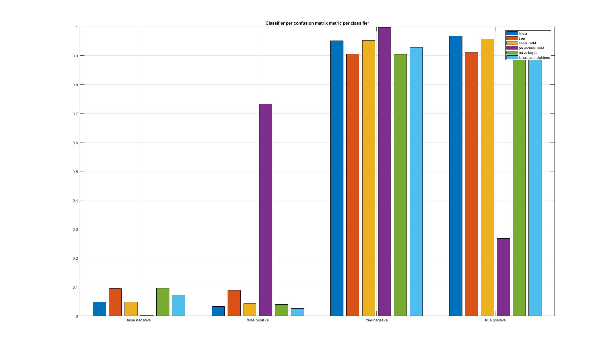
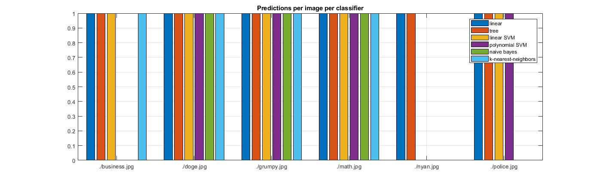

## fau-cap4630-2017f-ccarl2 Synopsis

Final project based on matlab example ["Deep Learning for Computer Vision with Matlab"](https://www.mathworks.com/company/newsletters/articles/deep-learning-for-computer-vision-with-matlab.html).

## Running the Script

* Downloaded images from the assignment recommended data set at [kagle.com](https://www.kaggle.com/c/dogs-vs-cats/data). Save these images to './data/PetImages/'.

* Open './ccarl2_ai_final_2017F.m' in Matlab program. If you are running this script from scratch, please note that the time to download test data, train Alex Net, generate the classifiers, and finally running the predictions may take anywhere from **1-8hrs** depending on your machine.

## Basic Code Structure

0. Create or import a convolutional neural network
1. Create a template of the classifier you want to use (other templates available at the fitecoc docs)
2. Create a classifier using the template with a fitecoc object
3. Generate labels using the classifier and generated features from the cnn
4. Predict an image label using the classifier and the cnn feature analysis

```
% 0. import cnn
convnet = helperImportMatConvNet(cnnFullMatFile);

% 1. create template
t = templateSVM('KernelFunction', 'linear');

% 2. create classifier
classifier = fitcecoc(trainingFeatures, trainingLabels, ...
    'Learners', t, 'Coding', 'onevsall', 'ObservationsIn', 'columns');

% 3. generate labels
predictedLabels = predict(classifier, testFeatures);
testLabels = testSet.Labels;


% 4. predict an image
img = readAndPreprocessImage(newImage);
imageFeatures = activations(convnet, img, featureLayer);
label = predict(classifier, imageFeatures);
```

## Results and Analysis

To train the pre-trained Alex-Net convolutional neural network for different pet images, I downloaded images from the assignment recommended data set at [kagle.com](https://www.kaggle.com/c/dogs-vs-cats/data). The total time it took to separate the data set into test and training sets took a grand total of ```3904.116s``` for roughtly 12500 images per cat **and** dog. Full details can be found at . For my machine, I am running the following relevant specifications, where CPU performance is most important for script time:

```
Intel i7-6800k (6 core/12 hyperthread/15mb cache) [BX80671I76800K]
Corsair 16GB DDR4 3000MHz C15 [CMK16GX4M2B3000C15]
EVGA GeForce GTX 1070 Founders Edition (8GB GDDR5) [08G-P4-6170-KR]
```

For the same convolutional neural network called Alex-Net, I used the following different types of classifiers: 'linear', 'tree', 'linear SVM', 'polynomial SVM', 'naive bayes', and 'k-nearest-neighbors'. The following are the testing images in order: './doge.jpg', './grumpy.jpg', './math.jpg', './business.jpg', './police.jpg', and './nyan.jpg.








I ran different analyses on each of the classifiers including the a) cpu time to generate features, cross-validate, and predict of each classifier, the b) confusion matrix of each classifier, and finally the c) accuracy of each classifier's predictions on pictures and memes of dogs and cats, alternating between dog and cat.

#### a) cpu time to generate features, cross-validate, and predict of each classifier



It should be noted that k-nearest-neighbors classifier by far took the most time to perform all three tasks combined while the other five were easily tolerable.

#### b) confusion matrix of each classifier



It should be noted that the polynomial SVM classifier was the most unreliable classifier in terms of false positive and true positive rates. However for true negative and false negatives this classifier is ideal. Perhaps in particular situations where negatives are a more valuable metric, the polynomial SVM classifier is a better choice.

#### c) accuracy of each classifier's predictions on pictures and memes of dogs and cats



It should be noted that the 'meme' images were the only ones that caused issues for any of the classifiers. New data like text or sunglasses on a dog are understandably not supposed to be in the training or test sets so recognition on these are expected to vary. Note that the Nyan Cat meme was the hardest cat to recognize accurately. **66%** of the classifiers recognized the Nyan Cat as a Nyan Dog. Classifiers that recognized all images correctly are as follows: 'linear', 'tree'. Strangely enough the quickest to implement and shortest processing time worked best. It is possible this is because linear and tree classifiers excell at binary predictions whereas others are better at multidimensional classification.

## Relevant Matlab Documentation

* [Tutorial](https://www.mathworks.com/company/newsletters/articles/deep-learning-for-computer-vision-with-matlab.html)
* [Sample Code](https://www.mathworks.com/matlabcentral/fileexchange/57116-deep-learning-for-computer-vision-demo-code)
* [Fitecoc Multiclass Model](https://www.mathworks.com/help/stats/fitcecoc.html)
* [TemplateSVM](https://www.mathworks.com/help/stats/templatesvm.html)
* [Bar](https://www.mathworks.com/help/matlab/ref/bar.html)
* [Legend](https://www.mathworks.com/help/matlab/ref/legend.html)